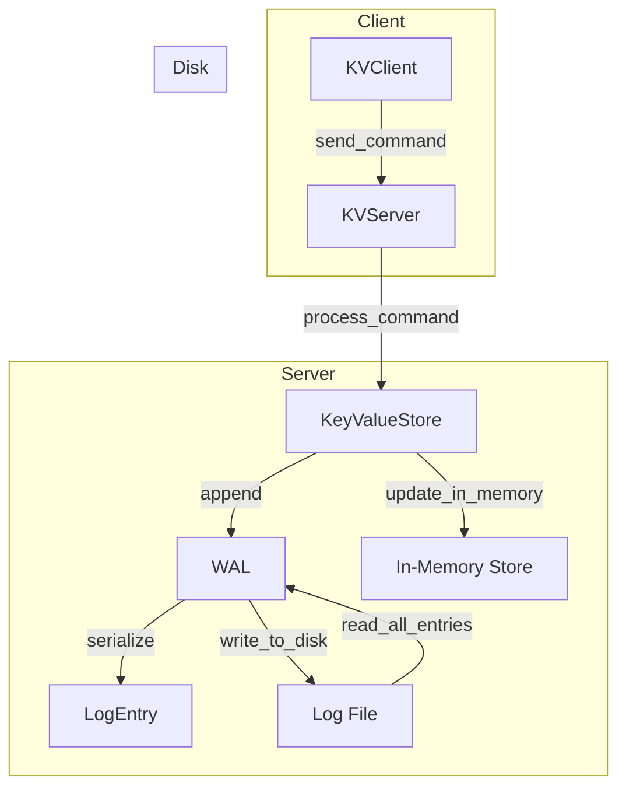

# Distributed Systems Patterns: Write-Ahead Log (WAL) Implementation

This project demonstrates a key-value store with Write-Ahead Logging (WAL) for durability.

## Setup

Create a virtual environment in the project root directory named ".venv"

### Commands

`make install-flit`

`make install-dev`

`make run` or `make test`

## Architecture

The project consists of the following main components:

1. **LogEntry**: Represents a log entry in the WAL system.
2. **WAL**: Manages the write-ahead log files, ensuring durability of operations.
3. **KeyValueStore**: A key-value store that uses WAL for durability.
4. **KVServer**: A server that handles client requests and interacts with the KeyValueStore.
5. **KVClient**: A client for interacting with the KVServer.

## Logic

### LogEntry

- Represents a log entry with attributes like sequence number, operation type, key, value, and timestamp.
- Provides methods to serialize and deserialize log entries.

### WAL

- Manages log files, appending new entries, reading all entries, and rotating log files based on size.
- Ensures that all operations are logged before being applied to the key-value store.

### KeyValueStore

- Provides methods to put, get, and delete key-value pairs.
- Uses WAL to log operations before applying them to the in-memory store.
- Supports recovery from WAL and creating checkpoints.

### KVServer

- Handles client connections and processes commands like GET, PUT, DELETE, KEYS, and CHECKPOINT.
- Uses KeyValueStore to perform operations and ensure durability.

### KVClient

- Connects to the KVServer and sends commands.
- Provides methods to interact with the key-value store on the server.

## Flow

### Write-Ahead Log (WAL) Implementation

1. **Client sends command**: The client sends a command (e.g., PUT, GET, DELETE) to the server.
2. **Server processes command**: The server receives the command and processes it using the KeyValueStore.
3. **KeyValueStore logs operation**: Before applying the operation, the KeyValueStore logs it using the WAL.
4. **WAL serializes log entry**: The WAL creates a LogEntry object and serializes it.
5. **WAL writes to disk**: The serialized log entry is written to the log file on disk.
6. **KeyValueStore updates in-memory store**: After logging, the KeyValueStore updates the in-memory key-value store.
7. **Recovery from WAL**: On startup, the KeyValueStore reads all entries from the WAL to rebuild the in-memory state.

## Current limitations & future improvements

- **Limitations**:
  - The current implementation uses pickle for serialization, which may not be secure or efficient for large-scale systems.
  - The WAL rotation threshold is fixed and may need to be configurable based on use case.

- **Future improvements**:
  - Implement more efficient and secure serialization methods.
  - Add support for configurable WAL rotation thresholds.
  - Enhance error handling and logging mechanisms.

#### Authors: Shahriyar Rzayev
